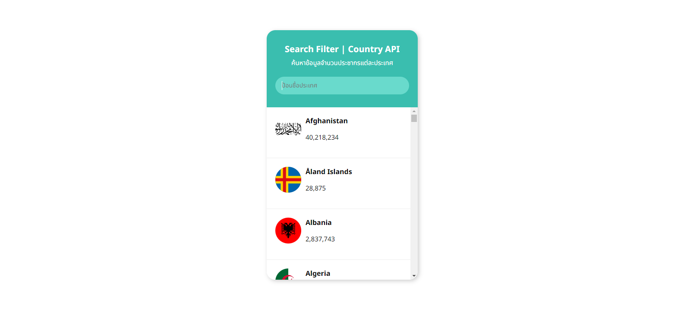

# Search-Filter
The purpose of the code is to retrieve country information from the API (https://restcountries.com/v2/all) and display the results in the DOM of the page. Here is a brief description of the code:

1. DOM Elements and Variables: 
resultElement: Holds the element with the id "result," which will be used to display a list of countries.
filterElement: Holds the element with the id "filter," which is the input element for filtering the list of countries.
countryList: Stores a list of countries that is created and displayed in the DOM.

2. Event Listener:
There is an event listener installed on filterElement. It works when data is entered into the input. When data is entered, the function filters the list of countries based on the entered word and hides/shows them based on the results.

3. FetchData Function:
The fetchData function is asynchronous and uses the fetch API to fetch country data from the URL "https://restcountries.com/v2/all."
When data is retrieved, the function clears the contents of resultElement and creates a list of countries from the retrieved data. This country entry will be added to countryList and displayed in resultElement.

4. CreateCountryListItem Function:
The createCountryListItem function is used to create an <li> element for displaying country information.
The function takes country information and uses it to create HTML for a country list with images, names, and populations.

5. FormatNumber Function:
The formatNumber function is used to format numbers used in population representations, adding a comma to every 3-digit number.

6. Page Loading Event:
Finally, fetchData is called to fetch the data when the page has finished loading.

All of this results in a list of countries with images, names, and populations on the page. It can be filtered based on words entered in the input element with the id "filter."

Links Solution URL: [https://github.com/hedisnice/Search-Filter]

Live Site URL: [https://hedisnice.github.io/Search-Filter/]
